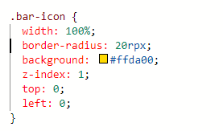

# minapp-scroll
自定义小程序滚动条  隐藏默认滚动条

## 布局
  外边包一层壳子 
  scroll-view 宽比外边壳子大20像素
  scroll-inner 跟外边壳子的宽度一样
  就可以达到隐藏默认滚动条的效果

## js 

  监听 scroll事件
  
  如果用户超过2秒不滚动， 就隐藏
  

### 这个只是简单的竖向自定义滚动条demo 

## 效果图片

## 只是加了一个状态

