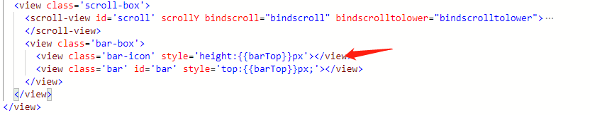

# minapp-scroll
自定义小程序滚动条  隐藏默认滚动条

## 布局
  外边包一层壳子 
  scroll-view 宽比外边壳子大20像素
  scroll-inner 跟外边壳子的宽度一样
  就可以达到隐藏默认滚动条的效果


## js 

  监听 scroll事件
  
  如果用户超过2秒不滚动， 就隐藏
  

### 这个只是简单的竖向自定义滚动条demo 


## 效果图片


## 只是加了一个状态  

 对应的 barHt  也要动态获取了
``` bash
   scrollInit() {
    wx.createSelectorQuery().select('#scroll').boundingClientRect((rect) => {
      this.setData({
        scrollBox: rect
      })
    }).exec()
    wx.createSelectorQuery().select('#bar').boundingClientRect((rect) => {
      this.setData({
        barHt: rect.height
      })
    }).exec()
    
  },
  bindscroll: function(e) {
    console.log(e)
    let scrollBound = this.data.scrollBox
    let scrollHeight = e.detail.scrollHeight
    let scrollTop = e.detail.scrollTop
    //滚动条bar高度根据显示区域占内容区域的比例显示
    let barHt = this.data.barHt
    let barTop = (scrollTop / (scrollHeight - scrollBound.height) * (scrollBound.height - barHt));
    this.setData({
      barTop: barTop
    })
  },
```



